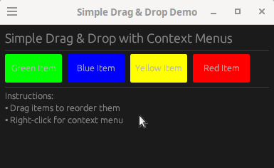

# egui_drag_and_drop_demo

The same demo but in egui 0.31 vs egui 0.32

Both show how to create elements that can be dragged and dropped.
0.31 has a right-click context menu. Something about 0.32 broke this and I made
this demo mostly to figure that out, but also because it could be useful for
others.

